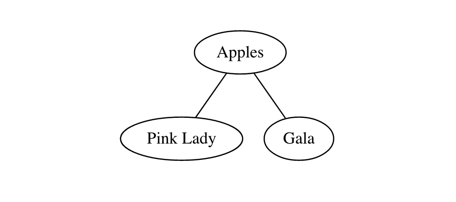

# lispDOT

LispDOT is a DOT Document Description Language implemented in Common Lisp.

DOT is a syntax used to describe the contents of a graph. Graph visualisation tools like [Graphviz](https://gitlab.com/graphviz/graphviz) interpret the contents of a DOT file and render a graph based on its contents.

## Getting Started

To use lispDOT, first load the `dot.lisp` file into your project:

    (load "dot.lisp")

### Creating a Graph

To create a graph, use the `(makegraph)` function.

This function accepts the following values:

    (graphtype name nodes metainformation)

- `graphtype`: the type of the graph, either "graph" (undirected) or "digraph" (directed).
- `name`: the name of the graph.
- `nodes`: a `(list)` object that contains either `(udc)` or `(dc)` items (see below for a description of these items).
- `metainformation`: any `(meta)` nodes that describe a value for a graph.

#### Nodes in Directed Graphs

Directed graphs are graphs where each connection describes the flow between two objects.

To define a node in a directed graph, use the following syntax:

    (dc (l "Item 1" "Item 2"))

This creates a directed connection between "Item 1" and "Item 2".

This connection creates the following DOT code:

    "Item 1" -> "Item 2";

#### Nodes in Undirected Graphs

Undirected graphs are graphs where each connection describes a relationship between two objects.

To define a node in an undirected graph, use the following syntax:

    (udc (l "Item 1" "Item 2"))

This creates an undirected connection between "Item 1" and "Item 2".

This connection translates into the following DOT code:

    "Item 1" -- "Item 2";

### Graph Meta Information

You may want to specify meta information about a graph (i.e. the graph size).

You can do this by specifying meta objects after your `nodes` list.

Here's an example piece of meta information:

    (meta "size" "5,5")

This creates a meta attribute. Here is the DOT code translation:

    meta [size="5,5"]

### Example

Here is an example of a simple undirected graph called "apples":

(princ
    (makegraph
        "graph"
        "apples"
        (l
            (udc (l "Apples" "Pink Lady"))
            (udc (l "Apples" "Gala"))))

This graph defines three nodes:

- Apples
- Pink Lady
- Gala

`Pink Lady` and `Gala` are both connected to the `Apples` node.

The graph is printed to the console using the Lisp `(printc)` function.

Here is the DOT file version of this graph:

graph apples { 
        "Apples" -- "Pink Lady"; 
        "Apples" -- "Gala"; 
}

Here is an image representation of the graph, generated using [Graphviz Visual Editor](http://magjac.com/graphviz-visual-editor/):

## License

This project is licensed under an [MIT License](LICENSE).

## Contributors

- capjamesg